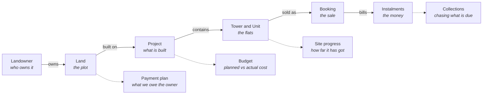
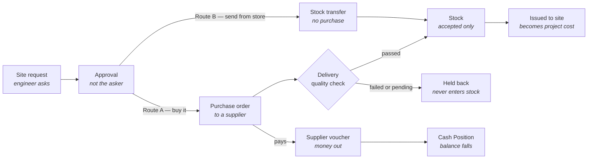
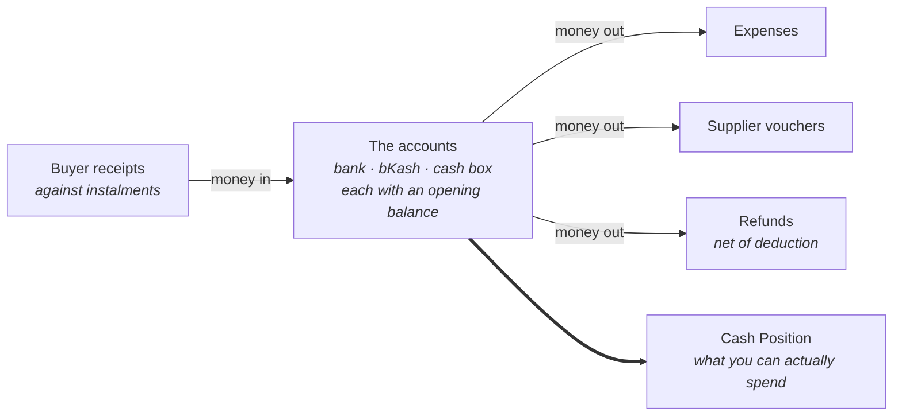

# Developer Suite — Platform Handbook

What the eight admin modules do in plain business terms, how a record travels
from a plot of land to money in the bank, and the rules the software enforces
on the way.

| | |
|---|---|
| **Modules** | 8 |
| **Screens** | 24 |
| **Roles** | 9 |
| **Admin portal** | Complete |
| **Public website** | Not started |
| **Last updated** | 2026-09-06 |

> Written for someone who does not know the codebase. No table names, no field
> names, no jargon. The companion documents are
> `Real-Estate-Developer-Platform_Scope-Document_v3.md` (the frozen scope and
> the decision log) and `OPEN-ITEMS.md` (what is deliberately still open).

---

## Contents

1. [The eight modules](#1-the-eight-modules)
2. [How it all connects](#2-how-it-all-connects)
3. [Module 1 — Land Management](#3-module-1--land-management)
4. [Module 2 — Projects](#4-module-2--projects)
5. [Module 3 — Sales & CRM](#5-module-3--sales--crm)
6. [Module 4 — Site Progress](#6-module-4--site-progress)
7. [Module 5 — Procurement](#7-module-5--procurement)
8. [Module 6 — Finance](#8-module-6--finance)
9. [Module 7 — Administration](#9-module-7--administration)
10. [Module 8 — Dashboard](#10-module-8--dashboard)
11. [The rules, collected](#11-the-rules-collected)
12. [Status lifecycles](#12-status-lifecycles)
13. [What is not built](#13-what-is-not-built)

---

## 1. The eight modules

These are the eight groups in the left sidebar, in the order they appear. They
follow the life of the business: buy land, build on it, sell it, collect the
money.

| # | Module | What it covers | Screens |
|---|---|---|---|
| 1 | **Dashboard** | What needs you today, filtered to what your role can act on | Overview |
| 2 | **Land Management** | Plots you are buying or have bought, and who owns them | Lands · Landowners |
| 3 | **Projects** | What gets built: towers, floors, individual flats | All Projects (with Towers & Units, JV Allocation, Budget) |
| 4 | **Sales & CRM** | Enquiries, the bookings they become, the buyers behind them | Leads · Bookings · Customers |
| 5 | **Site Progress** | How far construction has got, and what the site is asking for | Progress Updates · Material Requests |
| 6 | **Procurement** | Buying material: suppliers, orders, deliveries, store, payments | Material Requests · Purchase Orders · Suppliers · Stock · Material Items · Supplier Vouchers |
| 7 | **Finance** | Money in from buyers, money out to everyone else, what is left | Overview · Collections · Expenses · Cash Position · Refunds |
| 8 | **Administration** | Who sees what, the dropdown lists, the company letterhead | Users & Roles · Master Data · Company Settings |

---

## 2. How it all connects

Nothing in the system stands alone. A plot of land becomes a project, a project
produces flats, a flat is booked by a buyer, and the booking produces a payment
schedule that the collections desk chases. **Each step carries the one before it
with it.**

**Solid arrows** — one record creates the next.
**Dashed** — what hangs off that record.

A booking knows its unit, its tower, its project and, through the project, the
land it stands on. That is why a cost booked against a project can be traced
back, and why a flat cannot be sold twice.

Two branches leave this chain and both end in the same place — **Cash
Position**. Buyers pay money in; suppliers, contractors and landowners take
money out.

---

## 3. Module 1 — Land Management

> Everything about acquiring a plot, from the first site visit to the last
> payment to its owner.

### The two screens

**Lands** is *the plot*. It holds the legal identity of the land (mouza, dag,
khatian), its size, its location on a map, and the money: asking price,
negotiated price, and the final agreed amount. It also holds the acquisition
pipeline — the stages a plot passes through before it can be built on.

**Landowners** are *the people*. One plot can have several owners with different
shares, and one owner can hold shares in several plots. Keeping them separate
means you record a person once and link them wherever they appear, instead of
retyping a name on every plot they own.

### How land connects to the rest

| Direction | What flows |
|---|---|
| **In** | Costs recorded in Finance → Expenses against this land — payments to the owner, and registration, mutation and legal fees |
| **Out** | An acquired plot is linked to a **Project**. Under a joint venture, the owner's unit entitlement flows into that project's allocation |

### Rules

- **Two ways to acquire, and they behave differently.** A **direct purchase** is
  paid in taka, so it gets a payment plan. A **joint venture** pays the owner in
  flats instead, so there is no purchase price to schedule — the Payment plan
  tab says so rather than showing an empty table.
- **The balance means "still owed to the owner".** Registration, mutation and
  legal fees are money spent *on* the land but not money paid *for* it, so they
  are shown separately and never reduce what the owner is still owed.
- **A part payment stays on the instalment it fell short of.** Pay 15 lakh
  against a 20 lakh instalment and that instalment stays open for 5 lakh and
  goes overdue on its own date — the shortfall does not quietly move to the end
  of the plan. Arrears read as arrears.
- **The plan and the ledger cannot drift apart.** Instalments are never ticked
  off by hand; they are settled automatically from land-payment costs, oldest
  first. Record the payment in Finance and the plan moves.

---

## 4. Module 2 — Projects

> What gets built on the land — the towers, the floors, the individual flats,
> and what the whole thing is planned to cost.

### The screens

| Screen | What it is for |
|---|---|
| **All Projects** | Every development, with status, unit counts, sold percentage and booked value |
| **Towers & Units** | Inside a project: each tower, and each flat with floor, size, facing, price, status |
| **JV Allocation** | Which flats belong to the landowner under the joint venture, checked against what was agreed |
| **Budget** *(new)* | What each cost head is planned to come to, against what has actually been spent |

### What a project holds

A project is the container. Under it sit **towers**, and under each tower sit
**units** — the actual flats that get sold. A unit carries its own price built
from a base price plus premiums for floor and facing, plus parking and any other
charges. Units can be generated in bulk for a repeating floor layout rather than
entered one at a time.

Two things mark a unit apart:

- **Allocation** — whether it is the developer's share or the landowner's under
  a JV.
- **Who sells it** — whether the company sells it or the owner keeps it.

The second matters for money: a flat the owner keeps never produces revenue for
the company, so it is excluded from sales figures even though it still appears
in the inventory.

### How projects connect

| Direction | What flows |
|---|---|
| **In** | Land from Land Management. Construction progress from Site Progress. Costs from Finance and Procurement |
| **Out** | Units to Sales & CRM for booking. Project identity to every cost, so spending traces back to one development |

### Rules

- **A project cannot be closed on paper while it is unbuilt.** Moving a project
  down the pipeline is blocked when the facts contradict it — no tower, no
  reported progress, nothing handed over. Softer concerns appear as warnings you
  can proceed past.
- **Overall progress is the average of the towers, not the sum.** Each tower's
  work adds up to 100% on its own, so adding five towers together would report
  176% complete.
- **Landowner flats stay in the inventory but out of the revenue.** They are real
  flats and the building shows them; they are simply not money the company will
  ever collect.
- **Floor premium counts from the floor the tower starts at.** If a tower begins
  at floor 2, the price you type is floor 2's price — no premium nobody asked for
  is added on top.
- **The budget covers materials too.** Material bought through purchase orders
  has no cost category of its own, so the budget carries a dedicated "Materials"
  head. Without it the biggest line on most projects would be missing while the
  budget looked complete.

---

## 5. Module 3 — Sales & CRM

> From the first enquiry to a signed booking and the payment schedule that
> follows it.

### The three screens

**Leads** — enquiries from the website, WhatsApp, Facebook or walk-ins, with
follow-up history and who is handling them. A lead moves through contact, site
visit and negotiation, and ends either booked or lost. Leads are de-duplicated on
phone number so the same buyer calling twice does not become two people in the
pipeline.

**Bookings** — the sale itself. A booking attaches a buyer to a specific flat at
a specific price. The price is written down at that moment as a full breakdown —
base price, floor premium, facing premium, parking, other charges, less discount
— and **that breakdown never changes afterwards**, even if the flat is repriced
later. It is the copy the buyer signed.

**Customers** — buyers who have converted, with every booking and every taka they
have paid.

### How sales connects

| Direction | What flows |
|---|---|
| **In** | Available flats from Projects. Discount approval limits from Administration |
| **Out** | An instalment schedule to Finance → Collections. A unit status change back to Projects. A printed booking form and money receipt |

### Rules

- **A discount beyond your ceiling needs someone senior to approve it.** Each
  role has a maximum discount percentage. Above it the booking sits in "pending
  approval" until a higher role decides, with the reason recorded either way.
- **The instalment schedule is built from the money actually agreed with the
  buyer.** The booking amount the buyer negotiated wins over the project
  template's percentage — otherwise a buyer who paid the 10 lakh agreed with him
  would be billed the template's 13.37 lakh and be overdue the second his booking
  was confirmed.
- **Receipts fill the oldest unpaid instalment first.** A receipt is never split
  to make it fit; buyers pay in lumps that clear three monthlies at once, and they
  pay the booking money before a schedule exists at all. Money left over after
  every instalment is full is reported as an advance, not forced onto a line.
- **"Overdue" is never stored, only calculated.** It depends on today's date, so
  a stored value would be wrong the next morning.

---

## 6. Module 4 — Site Progress

> What the site has actually finished, and what it needs next.

### The two screens

**Progress Updates** — each tower is broken into **work items** (foundation,
superstructure, plumbing, electrical, finishing), each carrying a weight. The
site engineer reports a percentage against a work item, and everything above it
is calculated: the work item's status, the tower's progress, and the project's
overall percentage.

**Material Requests** — the bridge to Procurement. The site asks for cement;
Procurement decides whether to buy it or send it from the central store.

### How site progress connects

| Direction | What flows |
|---|---|
| **In** | Towers and work items from Projects. Delivery outcomes from Procurement |
| **Out** | Progress percentages to the project and the dashboard. Approved requests to Procurement |

### Rules

- **A work item's status is calculated, not chosen.** It comes from the reported
  percentage, so "100% but In Progress" cannot happen.
- **The person who asks is not the person who approves.** A site manager raises a
  material request; Procurement or the project manager approves it. One person
  cannot do both.
- **A site that goes quiet is flagged.** An active project that has not reported
  for 14 days is marked in red and rises to the top — because the real risk is
  not a delay you can see, it is a percentage that stopped being true weeks ago.
- **A rejected request records why.** The reason is stored separately from the
  requester's own note, so neither overwrites the other.

---

## 7. Module 5 — Procurement

> Buying material and getting it to site, from the request to the supplier's
> payment.

### The six screens

| Screen | What it is for |
|---|---|
| **Material Requests** | The approval queue, seen from Procurement's side |
| **Purchase Orders** | What was ordered from whom, at what rate, how much has arrived |
| **Suppliers** | Vendors, what they have supplied, what they are still owed |
| **Stock** | How much of each material is in each store right now, and what it is worth |
| **Material Items** *(new)* | The catalogue — one row per kind of material, with the unit it is stocked in |
| **Supplier Vouchers** | Payments made against purchase orders |

### Material Items vs Stock — the difference

**Material Items is the catalogue.** One row per *kind* of material: "Cement
(Shah Special)", stocked in bags. It has **no quantity** — it is the definition,
like an entry in a price list.

**Stock is how much of it is where.** One row per item *per store*: 2,030 bags of
that cement split across two sites and the central store.

> **One catalogue item → many stock rows.**

The catalogue exists because item names used to be typed free-hand, so "Cement
(Fresh)" and "cement fresh" became two different materials holding two separate
quantities at two separate average costs. Now the name is a label you can correct
freely and the stock stays attached to the item underneath it.

### The procurement chain

An approved request is either bought from a supplier or sent from the central
store. Only material that **passes** the quality check enters stock and counts
towards what the supplier is owed — a rejected delivery neither closes the order
nor creates a payable.

### Rules

- **Only accepted goods enter the store.** Material that failed its quality check
  is obvious. Material still *pending* a check is also held back — it is on site
  but not yet accepted, and valuing the store at the price of something that may
  go back would be wrong.
- **Order status is calculated from deliveries, not set by hand.** Otherwise
  someone could mark an order "Received" while nothing had arrived, and material
  that does not exist would appear in stock.
- **You cannot receive more than was ordered, or issue more than you hold.** Both
  are almost always typing mistakes, and letting them through would value the
  store at a price nobody paid.
- **Stock cost is a weighted average, and deleting a delivery does not rewind
  it.** The quantity goes back, but the average price stays where it is — a
  running average is not reversible, and the material may already have been issued
  at that rate. Real stores work the same way.
- **A supplier payment can only be raised from the order it pays.** That is what
  keeps the cost attached to the right project — letting the two be chosen
  separately would roll the money up against the wrong development.
- **Renaming a material moves nothing.** Stock is held against the catalogue item,
  not its spelling, so correcting a name updates every screen without splitting
  the quantity or the cost.

---

## 8. Module 6 — Finance

> Money in from buyers, money out to landowners, contractors and suppliers, and
> what is actually left in the accounts.

### The five screens

| Screen | What it is for |
|---|---|
| **Overview** | Sales value, collected, due and cost per project, with profit and budget variance |
| **Collections** | The chasing list: every buyer instalment, overdue first |
| **Expenses** | The cost ledger — land payments, contractor bills, marketing, admin, one-offs |
| **Cash Position** *(new)* | What is in each bank account, wallet and cash box right now |
| **Refunds** | Money returned on a cancelled booking, less any cancellation charge |

### The money map

**Not counted:** instalments that are due but not yet paid (a promise is not
money), stock moving between stores (already paid for when it was bought), and
budget lines (a plan).

These four are separate records — a buyer receipt is never also a supplier
voucher — so adding the first and subtracting the other three counts each taka
exactly once.

### What "Cash Position" is for

The question it answers: **"how much money do we actually have right now, and can
I pay BSRM on Thursday?"**

Before it, money in and out was scattered across four screens and nobody could
see the net. It is used mainly by Accounts and the owner, for three things:

1. **Check the balance** before committing to a payment.
2. **Reconcile against the real bank statement** — open an account's Statement and
   tick it off against the bank's.
3. **Catch mistakes** — the amber warning shows money recorded without an account.

### Rules

- **Collections is buyers only.** Land instalments are money *we* owe an owner,
  not money a buyer owes us, so they never appear in the chasing queue or in
  "still due".
- **Money with no account attached is shown, never hidden.** It is reported above
  the balance and deliberately left out of it — a total that silently absorbed
  unattributed entries would reconcile against no bank statement, which is the
  whole point of the screen.
- **An opening balance is part of the account.** Without it, a "position" is only
  the movement since the software was installed, which matches nothing the bank
  would show you.
- **A refund can never exceed what the buyer actually paid**, and only the net
  amount — after the cancellation charge — leaves the account.
- **Spending under a head nobody budgeted is flagged, not absorbed.** It still
  counts towards what has been spent, so the percentage stays honest, but it is
  called out as unplanned.
- **"Profit so far" and "profit at completion" are different questions.** The
  first compares sales with cost incurred to date, and a project mid-construction
  is expected to show a loss. The second compares sales with the *planned* cost.
  Both are labelled.
- **Supplier payments are added once, at roll-up.** They are kept out of the
  expense ledger so the same taka is not counted as both a cost and a payment.

---

## 9. Module 7 — Administration

> Who can see what, the option lists behind the dropdowns, and the letterhead on
> printed documents.

### The three screens

| Screen | What it is for |
|---|---|
| **Users & Roles** | Staff accounts, their role, assigned projects, and a readable permission matrix |
| **Master Data** | The dropdown lists — document types, unit types, facing, amenities, cost categories, material units |
| **Company Settings** | Name, address, trade licence and TIN — the letterhead on every printed document |

### What it controls

There are **nine roles**, from Super Admin down to Site Manager and Accounts, and
each sees a different application. The permission matrix decides which modules a
role can open, and it is enforced **on the address itself** — hiding a menu item
is presentation, not security, because the URL still works if someone types it.

**Master Data** is what stops small changes needing a developer. Adding "Legal &
Registration" as a cost category, or a new unit type, is a two-minute job for an
administrator.

Workflow statuses are deliberately **not** here: a booking moving to "Confirmed"
runs code that depends on that exact word, so an option added by hand would be a
status nothing knows how to handle.

### Rules

- **Built-in options can be renamed but never retired.** The finance screens
  depend on "Land Payment" existing; retiring it would leave no way to record a
  payment to a landowner while the land page carried on showing a balance as if
  there were.
- **Renaming an option changes the label, not the data.** Records store a stable
  key underneath, so correcting a name updates every screen at once without moving
  anything.
- **An option is retired, never deleted.** Records already using it keep reading
  correctly, and it can be brought back.
- **Company Settings is not decoration.** The name, address and licence numbers
  are what appear on the money receipt, booking form and supplier voucher.

---

## 10. Module 8 — Dashboard

> The opening screen: what needs attention today, filtered to what the person
> looking at it can actually act on.

The dashboard shows counts across land, projects, units, leads, bookings and site
updates; a money summary of collected, still due, overdue and due this month; and
the queues that need work — overdue instalments, leads waiting on follow-up,
requests waiting on approval.

### Rules

- **It shows only what your role can open.** There is no point putting a lead
  follow-up queue in front of someone who cannot open a lead.
- **Money is always shown in full.** Abbreviated figures were removed
  deliberately: an accountant cannot add a column of them, and "৳8M" beside
  "৳8,424,000" is a contradiction rather than a summary.

---

## 11. The rules, collected

The same rules as above, grouped by **the kind of mistake each one prevents**.
This is the shortest useful summary of what the software will and will not let
happen.

| Rule | What it does | Why |
|---|---|---|
| **Separation of duty** | The person who raises a material request cannot approve it. A discount above your ceiling needs a senior | One person should not be able to commit the company alone |
| **Derived status** | Work item, purchase order and instalment statuses are calculated, never picked from a dropdown | Stops states that contradict the facts — "Received" with nothing delivered |
| **Snapshot pricing** | A booking stores its own price breakdown and keeps it forever | The buyer signed a specific number; repricing the flat later must not rewrite it |
| **Oldest first** | Receipts and land payments fill the oldest unpaid instalment first, and overflow to the next | Matches how people actually pay — in lumps, and early |
| **Quality gate** | Only material that passed inspection enters stock or creates a payable | The store should never be valued at the price of goods that may go back |
| **No silent absorption** | Unbudgeted spending and unattributed money are shown separately, never folded into a total | A figure that hides its own gaps reconciles against nothing |
| **Stable keys** | Materials and cost categories are stored by an unchanging key; the name is only a label | Correcting a spelling must not split a stock balance or change what a figure means |
| **Delete guards** | A supplier with orders, an order with payments, a material with stock — none can be deleted, only retired | Records that point at them would stop making sense |
| **Count once** | Buyer receipts, expenses, supplier vouchers and refunds are separate records; stock movements are not money | The same taka must not be counted twice on its way through the business |
| **Permission at the address** | Access is checked on the URL, not just the menu | Hiding a link is presentation; typing the address still works |

---

## 12. Status lifecycles

The stages each kind of record passes through. **Bold** marks where a record
comes to rest; *italic* marks an ending that is not a success.

| Record | Lifecycle |
|---|---|
| **Land acquisition** | `new` → `site visit done` → `legal verification` → `negotiation` → `decision` → **`acquired`** / **`jv signed`** / **`linked to project`** / *`rejected`* |
| **Project** | `planning` → `design` → `approval` → `under construction` → `nearly complete` → `handover ongoing` → **`closed`** |
| **Unit** | `available` → `hold` → `reserved` → `booked` → `sold` → **`handed over`** |
| **Lead** | `new` → `contacted` → `site visit scheduled` → `site visit done` → `negotiation` → **`booked`** / *`lost`* |
| **Booking** | `hold` → `pending approval` → **`confirmed`** / *`cancelled`* |
| **Material request** | `pending` → `approved` → `ordered` → **`fulfilled`** / *`rejected`* |
| **Purchase order** | `draft` → `ordered` → `partially received` → **`received`** / *`cancelled`* |
| **Instalment** | `pending` → `partially paid` → **`paid`** / *`overdue`* |

---

## 13. What is not built

Recorded so it is visible rather than assumed. The admin portal is complete;
these are the deliberate gaps.

- **The public website has not been started.** It is a placeholder page. It comes
  next, and was deliberately left until last so it reads a database that has
  stopped changing.
- **Cheques are treated as paid on their date, not when they clear.** A cash
  position taken between the two is optimistic. The printed receipt already says a
  cheque is subject to realisation.
- **Money cannot be moved between accounts.** Transferring from the current
  account to petty cash has no home yet.
- **VAT and AIT are recorded but not reported.** The fields exist on bills and
  vouchers; there is no return summary yet.
- **No audit log.** The system records what a record says now, not who changed it
  and when.
- **Two catalogue items cannot be merged** if they turn out to be the same
  material. Duplicate names are prevented instead.
- **Project assignment is enforced at the screen, not yet in every query.** Roles
  are honoured; narrowing every figure to a user's own projects is a later phase.
- **Handover, snag lists and sales commission** are out of scope by agreement.

### One decision still open

Money is currently grouped the Western way — `BDT 45,000,000` — where this market
writes `4,50,00,000`. Switching would change every figure in the application at
once, including on the printed documents handed to buyers, so it is being decided
deliberately rather than in passing.

---

*Companion documents: `Real-Estate-Developer-Platform_Scope-Document_v3.md`
(frozen scope, schema and decision log) · `OPEN-ITEMS.md` (what is open and why)
· `REMEDIATION-PLAN.md` (the tiered work plan).*
